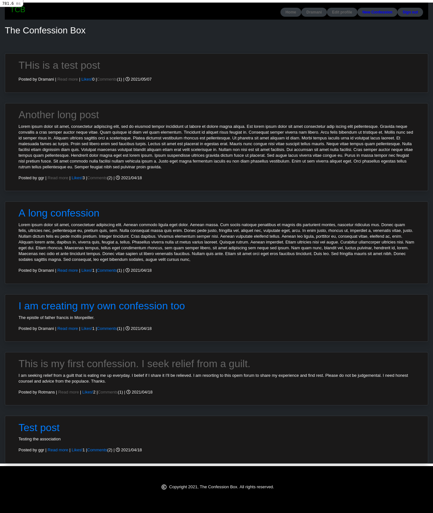
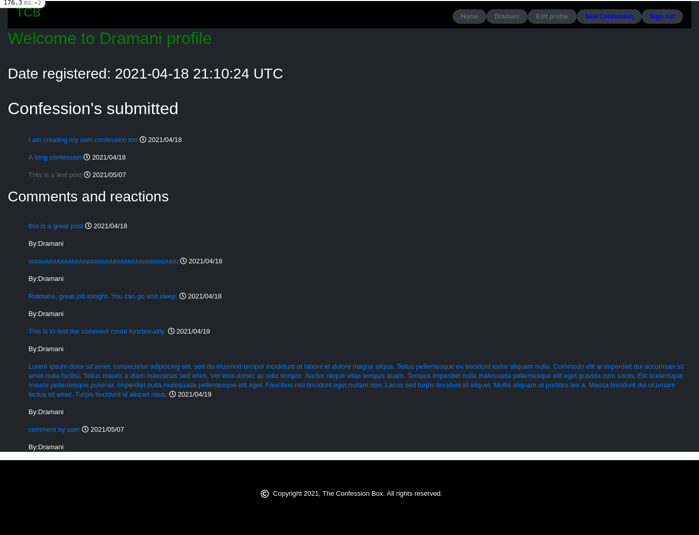
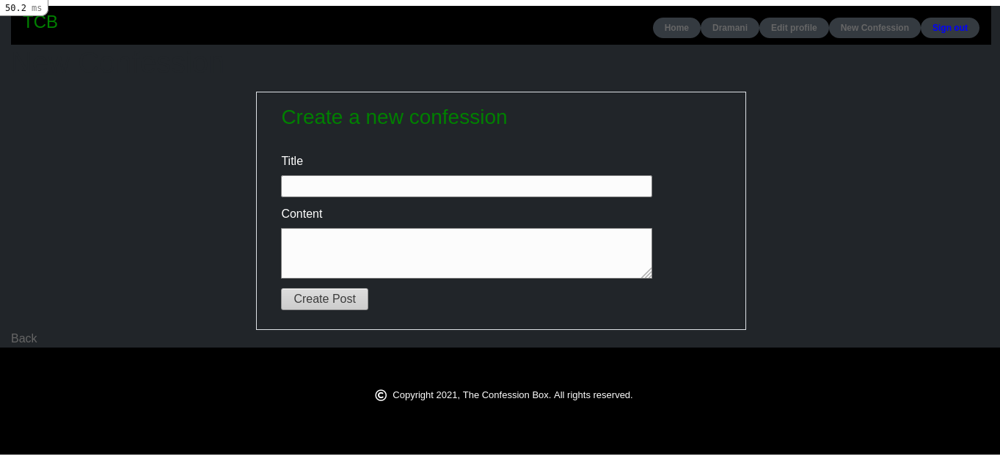

# README

# The Confession Box


## Project Description
> The Confession Box is a social web forum developed to characterize the ancient Roman Catholic Confession Box. Invented by Cardinal Charles Borromeo, in 1576. Although the concept of this project was to mimic the ancient confession box, it is merely a social web forum and is not intended to bear the strict religious nuances of the practice of the confessional.

> Registered users could submit their "confessions" anonymously and be listened to by (instead of a priest) the rest of the readers(who can also choose to be anonymous).
 

> The application represents an MVP of the product with the full graphical design but only basic features that would be extended in the future.

- Home page


- Proile page


-New confession page


## Built With

- ruby '3.0.0'
- Ruby on Rails v6.1.3'


## Tools and gems

- Devise
- Bootstrap
- Postgresql 

## Live Demo
[Deployed app](https://morning-brushlands-99503.herokuapp.com/)


### Set Up

- Go to the "Code" section of this repository and press the green button that says "Code". Copy the URL or the SSH key.
- Go to the terminal and enter:
```
git clone URL/SSH key
```
- If you don't have git, you can download this project and unzip it.
- Change directory into the folder the application is saved.
- To install the gems, run:
```
bundle install
```
- Install yarn (you need to have npm installed) by running:

```
npm install --global yarn
```

Setup database with:

```
   rails db:create
   rails db:migrate
```

Start server with:

```
    rails server
```

Open `http://localhost:3000/` in your browser.

## Usage

- Guests can read confessions of others.
- To comment, like or create a new confessions, guests need to sign up.
- All other in built features (edit profile, delete confession, edit confession) are fully implemented.


### Deployment

- Deployed on Heroku

## Author


👤 **George Gbenle**

- GitHub: [george-shammar](https://github.com/george-shammar)
- Twitter: [@GeorgeShammar](https://twitter.com/GeorgeShammar)
- LinkedIn: [George Gbenle](https://www.linkedin.com/in/georgegbenle/)


## 🤝 Contributing

Contributions, issues and feature requests are welcome!


## Show your support

Give a ⭐️ if you like this project!


## 📝 License

This project is [MIT](LICENSE) licensed.
