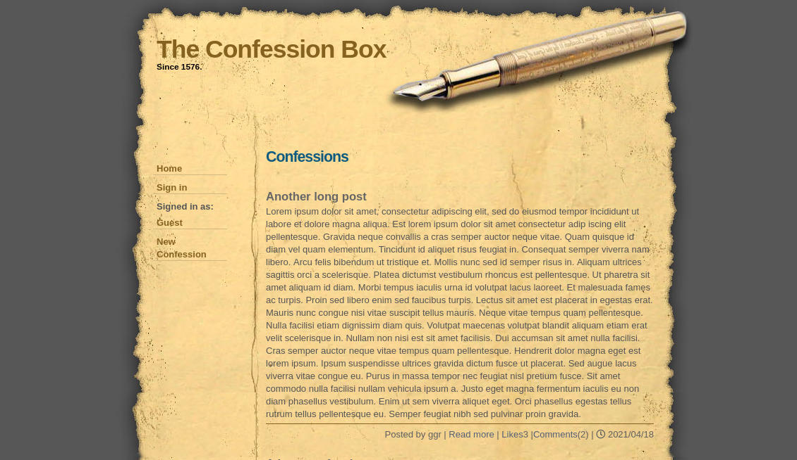
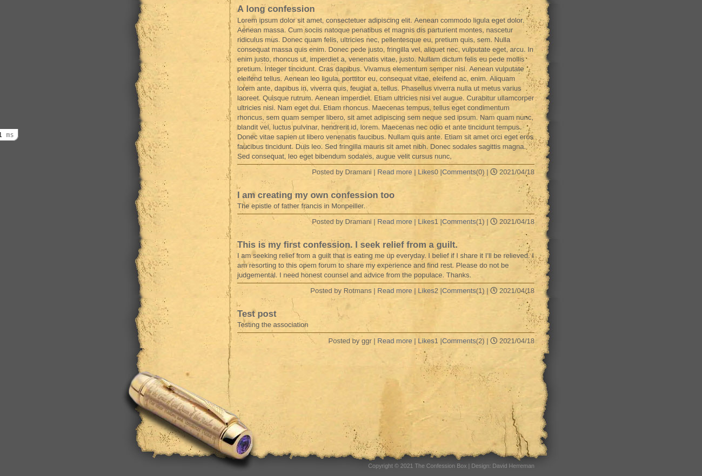
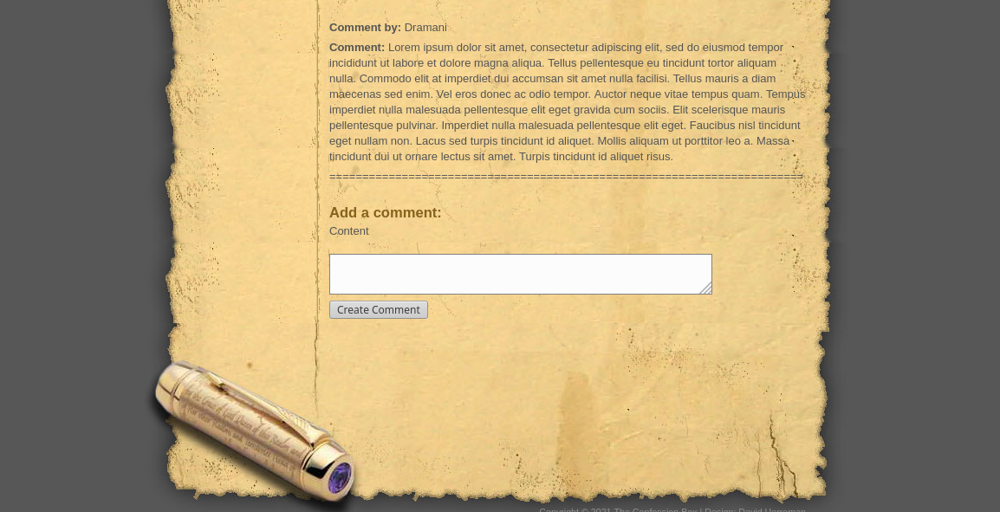

# README

# The Confession Box

## Project Description
> The Confession Box is a social web forum developed to characterize the ancient Roman Catholic Confession Box. Invented by Cardinal Charles Borromeo, in 1576. Although the concept of this project was to mimic the ancient confession box, it is merely a social web forum and is not intended to bear the strict religious nuances of the practice of the confessional.

> Registered users could submit their "confessions" anonymously and be listened to by (instead of a priest) the rest of the readers(who can also choose to be anonymous).

> The design uses an old newspaper template to present an ancient appeal of the original confession box. 

> The application represents an MVP of the product with the full graphical design but only basic features that would be extended in the future.

